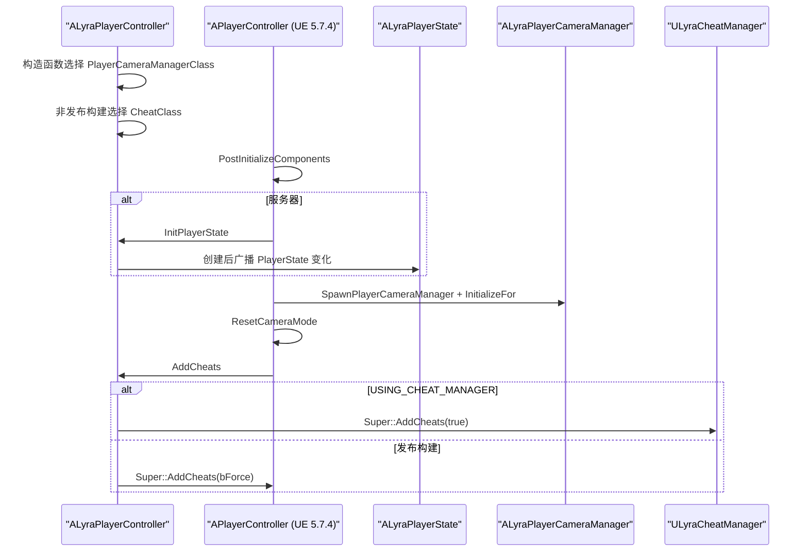
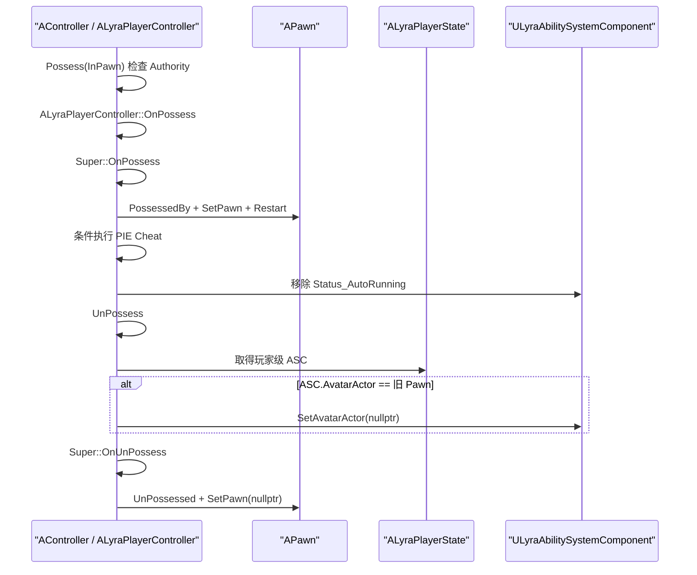
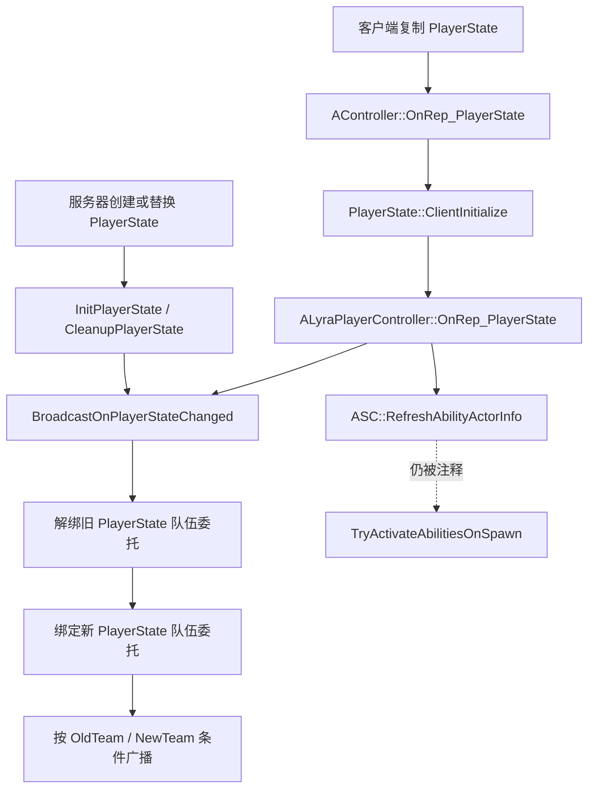
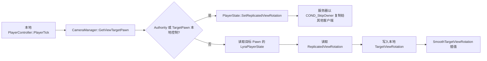
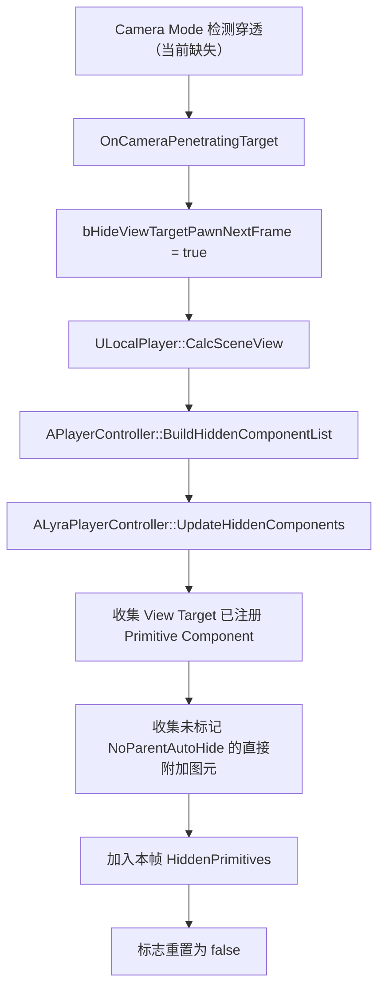
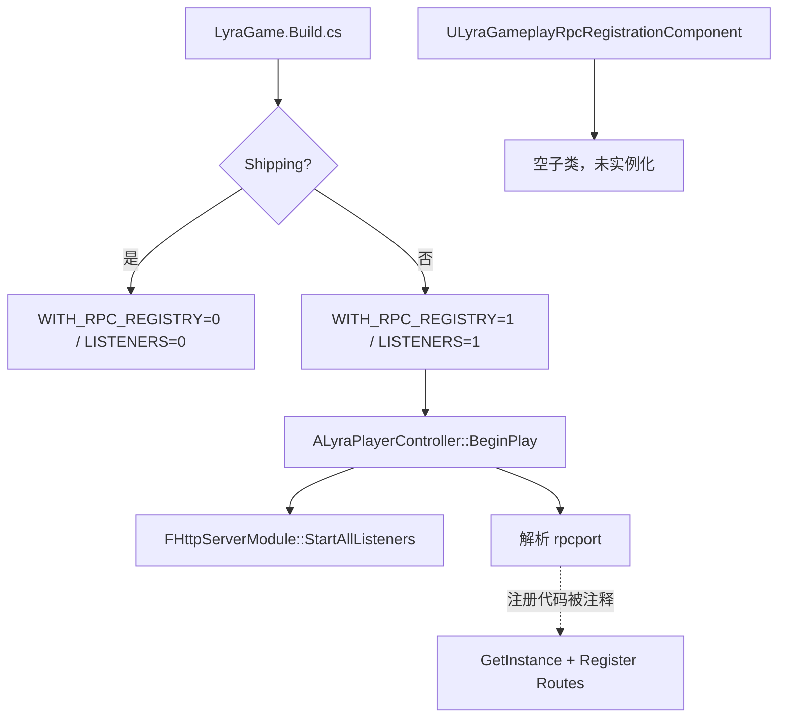

# 18 - 未提交源码对照与 PlayerController 调用链

> **阅读目标：**以当前工作区全部未提交代码为边界，理解 `ALyraPlayerController`（玩家控制器）如何连接 Pawn（角色实体）、`ALyraPlayerState`（玩家状态）、GAS（Gameplay Ability System，游戏玩法能力系统）、Camera（相机）、Replay（回放）、Cheat（作弊命令）和 External RPC（外部远程过程调用）；同时区分“源码已写入”“与 Lyra 静态对齐”和“已经运行验证”。

> **源码快照：**2026-07-13。结论来自当前项目、LyraStarterGame 原项目和 Unreal Engine 5.7.4（虚幻引擎 5.7.4）源码的静态阅读。没有执行编译、UHT（Unreal Header Tool，虚幻头文件工具）、PIE（Play In Editor，编辑器内运行）、联网、回放或 HTTP 测试。

---

## 1. 阅读边界与证据来源

### 当前工作区

| 范围 | 主要文件 | 用途 |
|------|----------|------|
| Controller / Replay | `Source/LyraGame/Player/LyraPlayerController.h/.cpp` | 当前生命周期、复制、输入、相机隐藏、作弊和回放行为 |
| Camera | `Source/LyraGame/Camera/LyraCameraAssistInterface.h/.cpp`、`LyraPlayerCameraManager.h/.cpp` | 相机协作协议与相机管理器现状 |
| Cheat | `Source/LyraGame/Player/LyraCheatManager.h` | 编译开关、继承关系和当前能力边界 |
| External RPC | `Source/LyraGame/Tests/LyraGameplayRpcRegistrationComponent.h/.cpp`、`LyraGame.Build.cs` | HTTP 自动化类型、构建开关与依赖 |
| 关联状态 | `LyraPlayerState.h/.cpp`、`LyraGameState.h/.cpp`、`LyraTeamAgentInterface.h` | ASC、观战旋转、录制者和队伍委托 |

`LyraPlayerState.h` 与 `LyraTeamAgentInterface.h` 的本轮未提交差异只补充中文注释，没有改变字段、函数或复制行为。本文仍阅读它们的既有实现，因为 PlayerController 新逻辑依赖这些状态。

### 对照源码

- Lyra 原项目：`D:\UE\project\C++Project\LyraStarterGame\Source\LyraGame\Player`、`Camera`、`Replays`、`Tests`。
- UE 5.7.4：`Engine\Source\Runtime\Engine\Private\Controller.cpp`、`PlayerController.cpp`、`PlayerCameraManager.cpp`、`LocalPlayer.cpp`。
- UE 5.7.4 GAS：`GameplayAbilities` 插件中的 `UAbilitySystemComponent` 与 `FGameplayAbilityActorInfo`。
- UE 5.7.4 HTTP / External RPC：`Engine\Source\Runtime\Online\HTTPServer` 与 `Engine\Source\Runtime\ExternalRPCRegistry`。

### 调用链起点、终点和停止边界

| 阅读链 | 起点 | 本文终点 | 暂不继续深入 |
|--------|------|----------|----------------|
| Controller 初始化 | `ALyraPlayerController` 构造函数 | Camera Manager / Cheat Manager 已由引擎创建或跳过 | Actor 生成全流程、网络登录握手 |
| 控制权与 GAS | `AController::Possess()` / `UnPossess()` | Pawn 控制关系与 ASC Avatar 状态稳定 | Character Movement（角色移动）内部 |
| 观战视角 | `APlayerController::TickActor()` | 本地 `TargetViewRotation` 被平滑消费 | 渲染矩阵与动画骨骼 |
| 相机穿透 | Camera Mode（相机模式）检测命中 | View Target 图元进入本帧隐藏集合 | 物理查询算法与材质淡出 |
| 回放 | 录制资格检查或回放 PlayerState 到达 | 开始录制，或 View Target 恢复 | DemoNetDriver 编码、磁盘格式 |
| External RPC | Build 宏与 `BeginPlay()` | Listener / Router / Route 是否真实存在 | HTTP Socket（套接字）实现 |

---

## 2. 当前状态总览

状态定义：

- **已静态对齐：**当前源码与 Lyra 原实现的关键行为一致，但没有运行证据。
- **部分完成：**入口和部分消费者存在，至少一个必要生产者、状态转换或依赖缺失。
- **未开始 / 骨架：**只有类型、构建依赖或空重写，尚不能形成目标功能。
- **无法确认：**必须依赖资产、蓝图、配置或运行结果才能判断。

| 功能 | 当前未提交代码 | Lyra 原设计 | 判断 |
|------|----------------|-------------|------|
| Controller 生命周期 | 已接入 Possess、UnPossess、PlayerState 变化、输入、力反馈、观战旋转和隐藏组件 | 同名路径均存在 | **部分完成**：GAS 输入、生成技能激活和共享设置仍注释 |
| Team Agent（队伍代理） | Controller 从 PlayerState 读 TeamID，迁移队伍委托并拒绝直接写入 | PlayerState 是权威来源 | **已静态对齐** |
| Camera Assist（相机辅助） | 接口、Controller 回调和一次性隐藏消费者已实现 | 第三人称 Camera Mode 负责调用回调 | **部分完成**：当前没有穿透检测生产者 |
| PlayerCameraManager（玩家相机管理器） | 类型已被选用，空子类继承 UE 基础行为 | 还有 UI Camera、80° FOV、视图覆盖和调试显示 | **部分完成**：引擎相机可用，Lyra 扩展缺失 |
| 观战旋转复制 | 禁用父类 OwnerOnly 字段，改用 PlayerState 的 SkipOwner 字段 | 同样为客户端回放和观战调整 | **结构静态对齐 / 有疑点**：服务器远程 Controller 的写入来源需验证 |
| Replay 播放跟随 | Replay Controller 已恢复录制者 PlayerState 与 Pawn 跟随 | 同名实现 | **已静态对齐**，待 Seek（跳转）/Checkpoint（检查点）验证 |
| Replay 客户端录制 | 资格函数和状态标记存在 | 调用 Replay Subsystem 真正开始录制 | **未完成**：资格恒 false，录制 API 和调用缺失 |
| Cheat Manager | 最小子类已创建，Controller 可在非发布构建生成它 | Lyra 子类提供大量项目专属命令 | **部分完成**：只继承引擎基础行为 |
| Server Cheat RPC | 两个 Reliable Server RPC 已实现 | 同名调试入口 | **部分完成 / 有风险**：验证函数恒 true |
| External RPC | 构建依赖、空子类、Listener 启动调用存在 | 单例、路由、JSON 和阶段端点完整 | **骨架**：当前没有 Lyra HTTP 路由 |

---

## 3. 初始化链：相机管理器、PlayerState 与 Cheat Manager



### UE 5.7.4 底层机制

`APlayerController::PostInitializeComponents()` 会在服务器初始化 PlayerState，然后在服务器和拥有者客户端生成 `PlayerCameraManagerClass` 指定的对象，调用 `InitializeFor()`，再重置 Camera Mode。客户端还会生成默认 HUD，最后进入 `AddCheats()`。

当前 `ALyraPlayerCameraManager` 没有自定义构造函数或重写，但并非“没有相机功能”：父类仍负责 View Target（视图目标）、镜头缓存、混合、旋转限制和更新。父类默认 FOV 为 90°，Pitch（俯仰）约为 -89.9° 到 89.9°。

### Lyra 原设计与当前差距

原项目相机管理器把 FOV 改为 80°、Pitch 改为 -89° 到 89°，创建 `ULyraUICameraManagerComponent`，并重写 `UpdateViewTarget()` 与 `DisplayDebug()`。当前项目只完成“让引擎生成 Lyra 命名的子类”，没有这些项目专属行为。

`ULyraCheatManager` 也采用相同模式：空子类仍继承 `UCheatManager`，但 Lyra 原项目的 GAS 调试、伤害/治疗、GameplayTag（游戏玩法标签）、无敌、固定相机和 Debug Camera（调试相机）命令尚未进入当前类。

---

## 4. 主调用链：Possess、UnPossess 与 ASC Avatar



### 节点职责与状态变化

| 节点 | 进入时状态 | 关键变化 | 离开时状态 |
|------|------------|----------|------------|
| `AController::Possess()` | Controller 可能已有旧 Pawn | 拒绝非 Authority（网络权威）请求，进入虚函数 `OnPossess()` | 由子类/父类完成控制切换 |
| `Super::OnPossess()` | 新 Pawn 尚未成为最终控制目标 | 解除旧 Pawn、`Pawn::PossessedBy()`、`SetPawn()`、控制旋转与 Restart | `GetPawn()` 可用于确认控制是否成功 |
| `ALyraPlayerController::OnPossess()` | 父类控制关系已稳定 | 编辑器服务器按配置执行命令；关闭 Auto-run（自动奔跑） | 控制器临时移动状态清理 |
| `ALyraPlayerController::OnUnPossess()` | 旧 Pawn 指针仍有效 | 仅当 ASC Avatar 正是旧 Pawn 时清空 Avatar | ASC 不再把旧 Pawn 当物理执行者 |
| `Super::OnUnPossess()` | ASC 已解除旧 Avatar | Pawn 解除控制，Controller 清空 Pawn | 控制关系结束 |

### 为什么 ASC 在 PlayerState，而 Avatar 是 Pawn

当前 `ALyraPlayerState` 创建并复制 `ULyraAbilitySystemComponent`，使用 Mixed Replication Mode（混合复制模式），并在 `PostInitializeComponents()` 中调用 `InitAbilityActorInfo(this, GetPawn())`：

- OwnerActor（拥有者 Actor）是跨死亡/重生持续存在的 PlayerState。
- AvatarActor（化身 Actor）是当前承载移动、动画和物理表现的 Pawn。
- `OnUnPossess()` 先清 Avatar，可避免旧 Pawn 被销毁或切换后，ASC 仍把它当作执行上下文。

Mixed 模式会把完整 Active Gameplay Effect（激活中的游戏玩法效果）信息发送给拥有者，把较精简的信息发送给非拥有者；它不意味着客户端可以成为属性或效果的网络权威。把 ASC 放在 PlayerState 上，也要求 PlayerState → PlayerController 的 Owner（所有者）链正确，才能识别拥有者连接。

当前 Controller 不负责给新 Pawn 设置 Avatar；这应由 Pawn Extension（Pawn 扩展）/Character 初始化链完成，而当前 `ULyraPawnExtensionComponent` 仍是另一个明确缺口。

---

## 5. PlayerState 复制补偿、队伍委托与 GAS 输入

### PlayerState 到达与补刷新



中文注释准确说明了这里的网络问题：远程客户端上，PlayerState 和 ASC 可能早于 PlayerController 完成解析，导致 `AbilityActorInfo->IsLocallyControlled()` 暂时判断失败。当前代码已经补做 `RefreshAbilityActorInfo()`，但原项目紧随其后的 `TryActivateAbilitiesOnSpawn()` 仍被注释，所以只能认定“上下文补刷新”完成，不能认定“生成时能力补激活”完成。

### 队伍状态

`ALyraPlayerController` 已实现 `ILyraTeamAgentInterface`：

- `GetGenericTeamId()` 委托给 PlayerState。
- `SetGenericTeamId()` 记录错误，不允许从 Controller 改写权威队伍数据。
- `BroadcastOnPlayerStateChanged()` 解绑旧委托、绑定新委托，只在 OldTeam 与 NewTeam 不同时广播。

这与 `LyraTeamAgentInterface.h` 新增中文注释表达的语义一致；本轮接口文件本身没有行为修改。

### 输入与 Auto-run

`SetIsAutoRunning()` 使用 ASC 的 Loose Gameplay Tag（松散游戏玩法标签）`Status_AutoRunning` 保存状态，变化成功后调用 C++ 与 Blueprint（蓝图）回调；`PlayerTick()` 再根据控制器 Yaw（偏航）向 Pawn 添加前向输入。

这条链不等于 GAS 输入已经接通：`PostProcessInput()` 中的 `LyraASC->ProcessAbilityInput()` 仍被注释。原项目会在此统一消费按下、保持和释放的 Ability Input Tag（能力输入标签）。

在该调用恢复前，不能从 Controller 侧证明输入会进入 Ability Activation（能力激活）、Prediction Key（预测键）或服务器确认/拒绝链；Loose Tag 驱动的 Auto-run 只是本地状态用法，不代表 GAS Prediction（GAS 预测）已经完成。

---

## 6. 观战视角：为什么禁用 TargetViewRotation 复制

### UE 5.7.4 默认行为

`APlayerController::GetLifetimeReplicatedProps()` 把 `TargetViewRotation` 与 `SpawnLocation` 注册为 `COND_OwnerOnly`。引擎服务器的 `TickActor()` 会在观战其他 Pawn 时写入 `TargetViewRotation`；拥有者侧随后在 `SmoothTargetViewRotation()` 中插值。

当前 Controller 使用：

```cpp
DISABLE_REPLICATED_PROPERTY(APlayerController, TargetViewRotation);
```

这会在 Lyra 子类中禁用继承字段的复制，不是发送默认值，也不是删除本地字段。

### 当前替代数据流



关键边界：

- UE 5.7.4 的 `TickActor()` 只有在 `PlayerInput` 存在时才调用 `PlayerTick()`，所以它通常是本地 Controller 的输入入口，不是所有服务器 Controller 的通用 Tick。
- 服务器写 `ReplicatedViewRotation` 才能向其他客户端复制。
- 本地客户端也会写同一字段，用于本地表现和 Client-saved Replay（客户端保存回放）；普通客户端写复制属性不会自动上行到服务器。
- `SetReplicatedViewRotation()` 的中文注释写着“仅在服务器上有效”，但函数体没有 Authority 检查。应以实际调用位置和 UE 复制方向理解，而不能把注释当运行时约束。
- PlayerState 采用 Push Model（推送模型）并在数值变化时标记 Dirty（脏），复制条件为 `COND_SkipOwner`。

更关键的是，UE 5.7.4 的 `TickActor()` 会让服务器上的非本地 Autonomous Proxy（自治代理）Controller 进入远程专用分支，该分支更新父类 `TargetViewRotation`，但不会调用 Lyra 的 `PlayerTick()`；当前 C++ 全局搜索也没有第二处 `SetReplicatedViewRotation()` 调用。因为父类字段的复制又被禁用，所以 Dedicated Server（专用服务器）上的远程玩家是否能为其他观战客户端持续提供有效旋转，不能仅凭“`HasAuthority()` 分支存在”得出肯定结论。这是需要优先用 Dedicated Server、Listen Server（监听服务器）、纯客户端观战和 Late Join（中途加入）验证的疑点。

---

## 7. 相机穿透到本帧隐藏集合

### 当前接口

`ILyraCameraAssistInterface` 提供三个可选扩展点：

- `GetIgnoredActorsForCameraPenetration()`：默认不追加忽略 Actor。
- `GetCameraPreventPenetrationTarget()`：默认返回未设置的 `TOptional`。
- `OnCameraPenetratingTarget()`：默认空实现。

`ALyraPlayerController` 重写最后一个回调，把 `bHideViewTargetPawnNextFrame` 设为 `true`。

### Lyra 原项目生产端

原项目 `LyraCameraMode_ThirdPerson.cpp` 在相机穿透焦点目标时，把 Controller、View Target 和防穿透目标转换为 `ILyraCameraAssistInterface`，然后调用 `OnCameraPenetratingTarget()`。当前项目没有该 Camera Mode 或其他同名调用者；全局搜索只能找到接口声明与 Controller 实现。

另有一个 API（应用程序编程接口）拼写差异：Lyra 原接口名为 `GetIgnoredActorsForCameraPentration()`，当前项目修正为 `GetIgnoredActorsForCameraPenetration()`。当前没有调用者，因此暂不影响行为；以后移植原 Camera Mode 时必须统一名称，不能直接逐行复制。

### UE 5.7.4 消费端



中文注释解释的 `FPrimitiveComponentId` 是跨游戏线程/渲染线程使用的轻量运行时标识；当前代码把 Scene ID（场景标识）放入隐藏集合，而不是把 UObject 指针交给渲染线程。

当前边界：

- 只处理 View Target 的组件和每个图元的直接附加子组件。
- 武器隐藏代码仍被注释。
- `NoParentAutoHide` 标签允许附加图元保留显示。
- 标志只消费一次；没有生产端时，这条路径正常情况下不会启动。

---

## 8. Replay：播放跟随已接回，客户端录制仍断链

### 客户端录制资格

`ShouldRecordClientReplay()` 已检查：

1. World 与 GameInstance 有效。
2. 当前既不播放回放，也不录制客户端回放。
3. 不是 Dedicated Server（专用服务器）。
4. Controller 是本地玩家。
5. 当前地图不是默认前端地图；PIE 会先移除 `UEDPIE_` 前缀。
6. 引擎 `UReplaySubsystem` 当前也不在录制或播放。

最后一步原本读取 `ULyraSettingsLocal::ShouldAutoRecordReplays()`，当前被注释，因此函数没有任何返回 `true` 的路径。

### `TryToRecordClientReplay()` 的假成功风险

该函数是 BlueprintCallable（蓝图可调用），当前 C++ 源码中没有调用者。若未来派生类让资格检查返回 `true`，它会：

1. 取得 `ULyraReplaySubsystem`。
2. 确认自己是第一个本地 PlayerController。
3. 在 GameState 写入 `RecorderPlayerState`。
4. 跳过已注释的 `ReplaySubsystem->RecordClientReplay(this)`。
5. 返回 `true`。

因此当前返回值可能只表示“录制者状态已设置”，不表示真正开始录制。Lyra 原项目会调用 `RecordClientReplay()`；当前 `ULyraReplaySubsystem` 连该 API 都尚未实现。

### 回放播放跟随

`ALyraReplayPlayerController` 的静态结构已与原项目对齐：

- `Tick()` 检测 `FollowedPlayerState` 是否因 Seek 或 Checkpoint 失效。
- 必要时绑定 `ALyraGameState::OnRecorderPlayerStateChangedEvent`。
- 读取当前 `RecorderPlayerState`，绑定其 `OnPawnSet`。
- 立即处理已有 Pawn，后续 Pawn 变化时再次 `SetViewTarget()`。
- `SmoothTargetViewRotation()` 保留父类插值。
- `ShouldRecordClientReplay()` 返回 `false`，防止回放观战 Controller 自己开始录制。

`RecorderPlayerState` 通过 `COND_ReplayOnly` 只在 Replay 场景复制；`ALyraGameMode` 也已经把 `ReplaySpectatorPlayerControllerClass` 指向该类型。仍需运行验证回放打开、时间轴拖动、检查点恢复和 Pawn 切换。

---

## 9. Cheat RPC 与 External RPC 是两条不同路径

| 对比项 | Server Cheat RPC（服务器作弊 RPC） | External RPC（外部 RPC） |
|--------|------------------------------------|--------------------------|
| 传输 | Unreal 网络复制 / Net Connection（网络连接） | HTTP Server（HTTP 服务器） |
| 入口 | `ServerCheat()`、`ServerCheatAll()` | HTTP Route（HTTP 路由） |
| 当前状态 | 可在非发布构建执行，要求 CheatManager 存在 | 没有当前 Lyra 路由 |
| 主要风险 | 验证函数恒 true、无命令白名单 | 一旦开放需设计绑定地址、鉴权、路由生命周期 |

### Server Cheat

两个函数都是 Reliable Server RPC（可靠服务器远程过程调用）并声明 `WithValidation`，但 `_Validate()` 无条件返回 `true`。执行体仍受 `USING_CHEAT_MANAGER` 保护，并要求 `CheatManager` 存在；`ServerCheatAll()` 会遍历世界内所有 Lyra PlayerController。

Unreal 的 Ownership（所有权）规则通常只允许客户端在自己拥有的 PlayerController 上发送 Server RPC，但每个已连接玩家都拥有自己的 Controller；当前验证逻辑不会进一步区分管理员、测试账号或普通开发客户端。

发布构建中宏为 false，这是主要防线；非发布联网服务器仍没有额外的调用者权限检查或命令白名单。它适合受控开发环境，不应视为安全的远程管理接口。

### External RPC 当前调用链



UE 5.7.4 的 `StartAllListeners()` 只遍历模块中已经存在的 Listener 并启动尚未监听的对象；它不会创建 Router 或 Route。`UExternalRpcRegistrationComponent::RegisterAlwaysOnHttpCallbacks()` 的父类实现也只广播 RPC 列表变化，不会添加端点。

当前子类没有 `GetInstance()`、静态对象、Route Handler（路由处理函数）或注销逻辑，Controller 中相关调用全部注释。因此即使命令行提供 `-rpcport=`，也没有静态证据表明 Lyra HTTP Endpoint 可用。

同时，`StartAllListeners()` 位于 `rpcport` 判断之前，并且 `BeginPlay()` 会在每个 Lyra PlayerController 上运行：即使没有传 `-rpcport=`，它仍可能启动其他模块已经创建的全局 HTTP Listener。当前 `EndPlay()` 只调用 `Super`，没有对应停止或注销动作。该副作用不等于存在 Lyra 路由，但需要在共享开发进程中确认绑定地址、既有 Listener 来源和预期的全局生命周期。

Lyra 原项目则会创建并 Root 单例，解析 Listener Address（监听地址）与 Sender ID（发送者标识），注册作弊、玩家状态、单次开火及比赛阶段路由，并在需要时注销。这些行为当前均未复刻。

---

## 10. 差距、风险与疑点

| 优先级 | 差距 / 疑点 | 影响 |
|--------|-------------|------|
| 高 | `ProcessAbilityInput()` 注释 | Ability Input Tag 无统一消费入口，GAS 输入链不完整 |
| 高 | `TryActivateAbilitiesOnSpawn()` 注释 | 客户端复制顺序补偿只刷新 ActorInfo，不补激活生成能力 |
| 高 | Pawn Extension / AbilitySet 授予仍未完成 | 新 Pawn 的 Avatar、能力和输入初始化可能断链 |
| 高 | 客户端 Replay 资格恒 false，录制 API/调用缺失 | 无法据当前源码声称自动客户端回放可用 |
| 高 | 服务器远程 Controller 绕过 `PlayerTick()`，且无第二处观战旋转 Setter 调用 | Dedicated Server 上远程玩家的 `ReplicatedViewRotation` 可能没有权威更新来源 |
| 中 | Camera Assist 没有穿透生产者 | 一次性隐藏消费者无法由正常相机流程触发 |
| 中 | PlayerCameraManager 缺少 UI Camera 和 Lyra 覆盖 | UI 接管、FOV、调试显示与原项目不一致 |
| 中 | `TryToRecordClientReplay()` 可能未录制却返回 true | 调用方可能误判成功 |
| 中 | Server Cheat 验证恒 true | 非发布联网环境暴露高权限命令入口 |
| 中 | External RPC 只启动已有 Listener，不注册路由 | 自动化测试端点不可用；未来开放需补安全设计 |
| 中 | 每个 PlayerController 在检查 `rpcport` 前调用全局 `StartAllListeners()` | 可能无参数启动其他模块既有 Listener，并产生重复全局调用 |
| 低 | Camera 接口修正了原项目拼写 | 后续移植原调用点时会发生名称不匹配 |
| 无法确认 | 蓝图、资产或 GameFeature 是否另有调用者 | C++ 全局搜索未发现，不代表 Content（内容资产）中绝对不存在 |

---

## 11. 推荐下一步

1. **先验证构建边界。** 用户自行编译 Editor（编辑器）与非发布 Target（目标），确认新增 UINTERFACE（虚幻接口）/UCLASS（虚幻类）、`Within=PlayerController` 和 External RPC 模块依赖通过 UHT 与链接。
2. **优先补齐 GAS 主链。** 按 Pawn Extension → ASC Avatar → AbilitySet 授予 → `ProcessAbilityInput()` → 生成技能补激活的顺序学习和复刻，避免先把外围相机/自动化当成主链完成。
3. **再连接相机生产端。** 对照原 `LyraCameraMode_ThirdPerson`，明确谁执行穿透检测、谁调用接口、何时只隐藏一帧；同步决定沿用原拼写还是统一当前 API。
4. **分开验证回放播放与录制。** 播放侧测试 Recorder PlayerState、Seek、Checkpoint、Pawn 切换；录制侧先补 Subsystem API 和真实调用，再定义成功返回值。
5. **最后开放自动化入口。** External RPC 上线前先确定仅本机还是局域网绑定、身份验证、命令白名单、阶段路由注册/注销和发布构建裁剪。
6. **保持注释与代码约束一致。** 尤其是 `SetReplicatedViewRotation()` 的“仅服务器有效”注释；若没有 Authority 检查，文档和调用方都应明确客户端本地写入的真实用途。

---

## 12. 用户自行验证清单

| 场景 | 建议观察点 | 通过标准 |
|------|------------|----------|
| 构建 | Editor、Development Client/Server、Shipping 宏裁剪 | 新类型通过 UHT/链接；Shipping 中 Cheat 执行体为空操作，RPC Registry / HTTP Listener 功能关闭且没有端点 |
| Possess / UnPossess | ASC OwnerActor、AvatarActor、旧 Pawn 生命周期 | 解除控制前 Avatar 清空，新 Pawn 初始化后 Avatar 正确 |
| 远程客户端 | `OnRep_PlayerState()`、ActorInfo、本地控制判断 | PlayerState 先到或 PC 晚到时 ActorInfo 能恢复；生成能力按预期补激活 |
| GAS 输入 | Ability Input Tag 按下/保持/释放 | `PostProcessInput()` 每帧统一消费且暂停行为明确 |
| 多人观战 | Dedicated Server、Listen Server、Client、Late Join | 远程玩家的服务器 PlayerState 持续更新旋转；非拥有者视角连续，拥有者不依赖 SkipOwner 数据 |
| 相机穿透 | 回调是否产生、隐藏集合、`NoParentAutoHide` | 穿透时只隐藏预期图元，下一帧标志被消费 |
| Replay 播放 | 打开、拖动、检查点、Pawn 更换 | Replay Controller 始终重新跟随录制者 Pawn |
| Replay 录制 | 资格、实际录制状态、返回值 | 返回 true 时引擎确实进入录制状态并生成可播放回放 |
| Cheat | 拥有者客户端、非拥有者、Dedicated Server | 只允许预期开发身份和命令；发布构建不可用 |
| External RPC | 有/无 `-rpcport=`，路由列表与绑定地址 | 未注册时没有 Lyra 端点；开放后路由与鉴权符合设计 |

---

## 关联文档

- [03-System-Framework.md](03-System-Framework.md) — Replay Subsystem（回放子系统）当前边界
- [05-Player-Framework.md](05-Player-Framework.md) — PlayerController、PlayerState 与 Camera 类职责
- [11-Development-Tools.md](11-Development-Tools.md) — Cheat 与 External RPC 开发入口
- [15-Data-Flow-and-Lifecycle.md](15-Data-Flow-and-Lifecycle.md) — Experience、复制与玩家生成时序
- [16-Stubs-and-Planned-Features.md](16-Stubs-and-Planned-Features.md) — 当前缺口与复刻优先级
- [17-Engine-Lifecycle-Reference.md](17-Engine-Lifecycle-Reference.md) — UE 5.7.4 生命周期钩子速查
